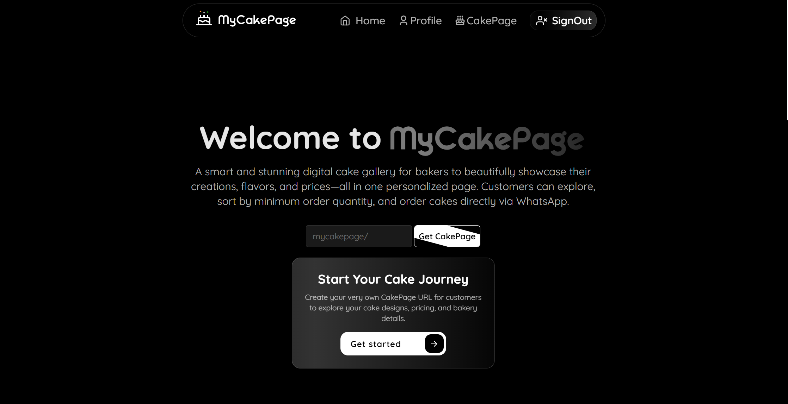

# 🎂 MyCakePage: The Smart Digital Showroom for Bakers

**MyCakePage** is a full-stack, smart digital platform designed to empower bakers by providing a single, beautifully organized page to **showcase their cake creations, flavors, and dynamic pricing**. Customers enjoy a seamless experience where they can **explore, filter, and instantly place orders via WhatsApp**.

---

## 🚀 Live Demos

| Component | URL |
| :--- | :--- |
| 🌐 **Live Frontend (Client View)** | [https://cake-page-eight.vercel.app](https://cake-page-eight.vercel.app) |
| 🧠 **Backend API** | [https://cakepage.onrender.com](https://cakepage.onrender.com) |

---

## 🖼️ Project Showcase



---

## ✨ Key Features & Benefits

MyCakePage solves common challenges for both bakers and their customers, making the ordering process simple and transparent.

### 👩‍🍳 For Bakers: Simplify & Sell More
- **Professional Showcase:** Display categorized cake designs with high-quality images.  
- **Dynamic Pricing:** Set and manage prices that adjust based on **per-kg and per-flavor** selections.  
- **Detailed Customization:** Attach available flavors and set a **minimum order quantity** (e.g., 0.5kg or 1kg) for each cake.  
- **Easy Sharing:** Promote your business by sharing your unique **CakePage URL** and **QR codes** for instant access.  
- **Direct Orders:** Receive instant, structured **WhatsApp orders**, eliminating order confusion.  

### 🍰 For Customers: Explore & Order Instantly
- **Advanced Filtering:** Easily browse cakes by **category**, **quantity range** (e.g., 0.5kg to 5kg), and desired **flavors** (chocolate, vanilla, etc.).  
- **Smart Sorting:** Quickly find what you need by sorting cakes by **price, quantity, or newest first**.  
- **Transparent Cost:** View the **dynamic per-kg pricing** update in real-time as you customize the quantity.  
- **Custom Notes:** Add a **custom cake message or notes** directly into the order.  
- **Instant Checkout:** Place orders via **WhatsApp** in just a few clicks.  

### 🧠 Smart Admin Panel: Manage Your Empire
- **Cloud-Powered Uploads:** Effortlessly upload cakes and images using **Cloudinary**.  
- **Real-time Management:** Manage categories, flavors, prices, descriptions, and stock status.  
- **Instant Preview:** See changes reflected instantly with the **CakePage preview**.  
- **Performance Tracking:** Track page views and engagement metrics.  

---

## ⚙️ Tech Stack: Modern & Robust

This project is built using a modern **MERN-adjacent stack** for a fast, scalable, and responsive application.

| Component | Technology | Role & Key Libraries |
| :--- | :--- | :--- |
| **🖥️ Frontend** | **React.js (Vite)** | Responsive UI and state management |
|  | **TailwindCSS** | Utility-first styling for rapid, clean design |
|  | **React Router DOM** | Declarative navigation |
|  | **Axios** | API integration and HTTP requests |
|  | **Lottie**, **React Hot Toast**, **QRCode.react** | Enhanced UI/UX components |
| **⚙️ Backend** | **Node.js + Express.js** | Fast, scalable RESTful API server |
|  | **MongoDB (Mongoose)** | Flexible, non-relational database |
|  | **Cloudinary** | Secure cloud storage for cake images |
|  | **JWT + bcryptjs** | Secure token-based authentication |
|  | **Nodemailer** | Handles email contact forms |

---

## 🛠️ Backend Setup & Installation

Follow these steps to get the MyCakePage backend running on your local machine.

### 1. Clone the Repository
```bash
git clone https://github.com/ShaikSazid/CakePage.git
cd CakePage/backend
```

### 2. Install dependencies
```bash
npm install
```

### 3. Configure Environment Variables
Create a file named .env inside the backend directory and populate it with your configuration details:

```bash
PORT=8080
MONGO_URI=your_mongodb_connection_string
FRONTEND=https://cake-page-eight.vercel.app   # Or your local frontend URL
GMAIL_USER=your_gmail@gmail.com
GMAIL_PASS=your_gmail_app_password            # Use an App Password, not your main account password
CLOUDINARY_CLOUD_NAME=your_cloud_name
CLOUDINARY_API_KEY=your_api_key
CLOUDINARY_API_SECRET=your_api_secret
JWT_SECRET=a_very_secret_key_for_jwt
```

### 4. Run the Backend Server
```bash
npm run dev
```

## 👨‍💻 Author & License

| Detail | Information |
| :--- | :--- |
| **Author** | Shaik Sazid |
| **Email** | 📧 [Shaiksazid7386@gmail.com](mailto:Shaiksazid7386@gmail.com) |
| **Project URL** | 🌍 [https://cake-page-eight.vercel.app](https://cake-page-eight.vercel.app) |
| **GitHub** | 🐙 [https://github.com/ShaikSazid](https://github.com/ShaikSazid) |
| **License** | 📜 This project is licensed under the [MIT License](./LICENSE) — see the LICENSE file for details. |
